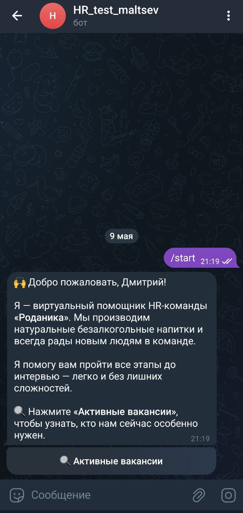
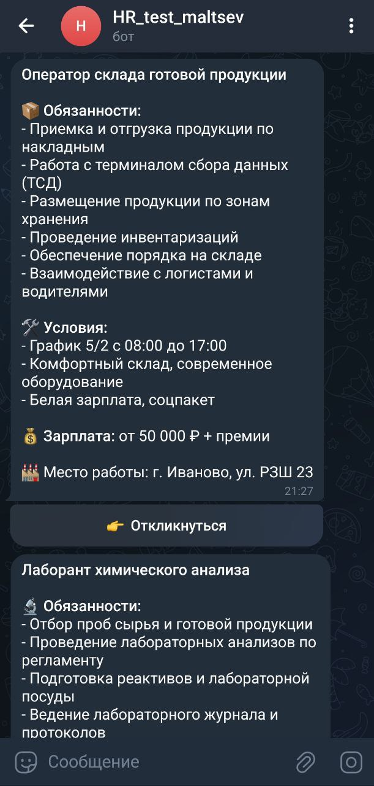
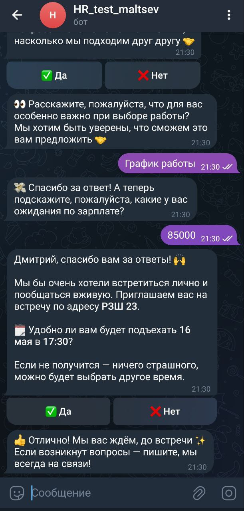
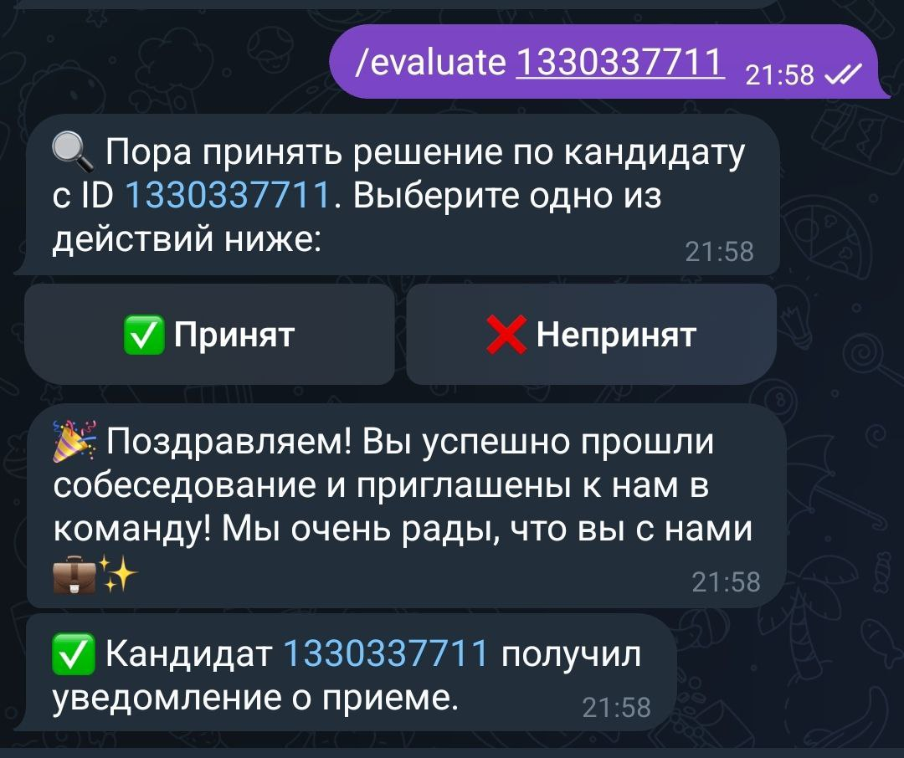
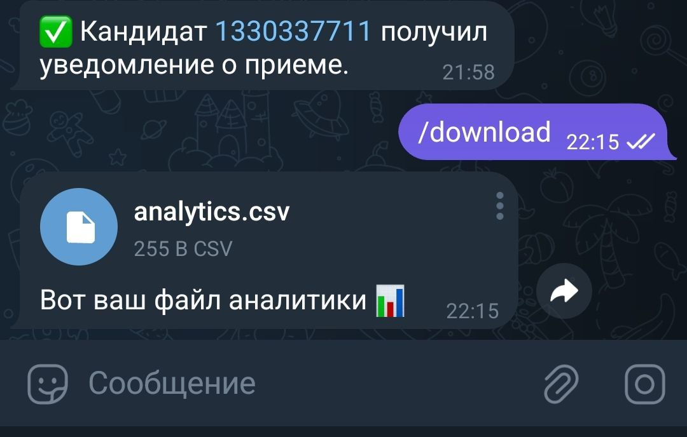

# 🤖 Telegram HR Бот
Телеграм-бот для автоматизации подбора персонала. Позволяет ускорить обработку откликов, провести мини-интервью и принять решение по кандидату без участия HR на первых этапах.

##  📌 Возможности
Отображение списка актуальных вакансий
Сбор информации об откликах и заинтересованных кандидатах
Проведение мини-интервью: вопросы, зарплатные ожидания и пр.
Автоматическое приглашение на интервью с учётом рабочего графика
Возможность вручную принять решение по кандидату
Сбор аналитики и логирование всех действий в файл CSV

##  Запуск

### 1. Склонируйте репозиторий

```cmd
git clone https://github.com/maltsev-d/Telegram_HR_bot_ru.git
cd Telegram_HR_bot_ru
```

### 2. Создайте файл `.env` и добавьте в него свой токен:

```env
BOT_TOKEN=реальный_токен
```

### 3. Установите зависимости

Убедитесь, что у вас установлен Python 3.10 или выше.

```cmd
pip install -r requirements.txt
```

### 4. Запустите бота

```cmd
python main.py
```

##  Используемые технологии

- Python 3.13
- [Aiogram 3.7.x](https://docs.aiogram.dev/en/latest/)
- FSM (Finite State Machine) для управления диалогами
- CSV для хранения аналитики

##  Структура проекта
- `main.py`             — Главная логика и маршруты
- `texts.py`            — Все текстовые сообщения
- `keyboards.py`        — Кнопки и клавиатуры
- `states.py`           — Состояния FSM
- `vacancies.py`        — Список вакансий
- `analytics.py`        — Обработка и сохранение аналитики
- `data/analytics.csv`  — CSV-файл с данными
- `requirements.txt`    — Список зависимостей проекта
- `.env`                — переменные окружения (в локальной среде)

###  Команды Telegram-бота

| Команда        | Описание                                                     |
|----------------|--------------------------------------------------------------|
| `/start`       | Запуск бота                                                  |
| `/evaluate ID` | HR-оценка кандидата по ID (например: `/evaluate 123456789`)  |
| `/download`    | Скачать CSV-файл с аналитикой.                               |
| `/vacancies`   | Список всех вакансий                                         |

##  Скриншоты

### Приветствие и главное меню
Бот отправляет приветственное сообщение с кнопками для взаимодействия.



---

### Актуальные вакансии
Пользователь видит список открытых вакансий и может откликнуться.



---
### Интервью и вопросы
Бот задаёт уточняющие вопросы (зарплата, график и т.д.) и предлагает время собеседования.



---

### Оценка кандидата
HR может принять или отклонить кандидата.



---

### Скачивание аналитики
Файл analytics.csv доступен для скачивания через команду /download.



---

##  Автор

[@dmitriimaltsev](https://t.me/dmitriimaltsev)